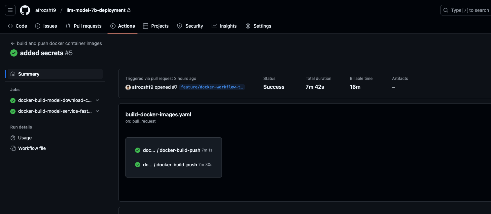
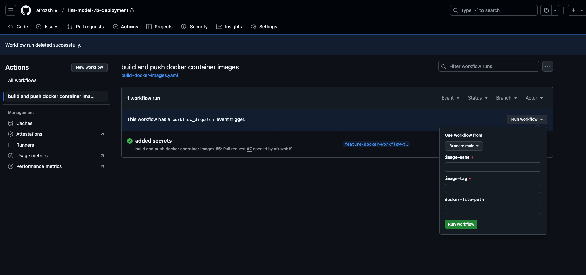

# LLM Model Deployment

The repository provides a scalable and fault tolerant way to deploy a Large Language Model (LLM) using helm charts.
The solution integrates optional Prometheus monitoring, supports PVC-based model storage, and includes advanced scaling features.

## Table of Contents
* [Motivation](#motivation)
* [Features](#features)
    * [1.Automated Docker Image Generation](#1-automated-docker-image-generation)
    * [2.Model Management](#2-model-management)
        * [2.1 Low-Precision Inference (Device-Agnostic Execution)](#21-low-precision-inference-device-agnostic-execution)
        * [2.2 Handling Input Tensors (Device-Agnostic Execution)](#22-handling-input-tensors-device-agnostic-execution)
    * [3. Autoscaling](#3-autoscaling)
    * [4. Platform Agnoticism](#4-platform-agnoticism)
    * [5. Environment Specific Configuration](#5-environment-specific-configuration)
* [Monitoring Configurations](#monitoring-configurations)
* [Deployment Instructions](#deployment-instructions)
* [Helm Configurations](#helm-configurations)

## Motivation
The idea was to build a robust and efficient model-serving infrastructure. This comes with a small amount of challenges and complexities.

1. **Model Size and Persistence**:
    - LLMs often come with high memory utilisation, making ephemeral storage nearly impractical for each pod.
    - Using Persistent Volume Claim (PVC) or an external storage mechanism allows shared storage that ensures models are securely loaded once and reused across multiple pods. This is also essential since every model download from source like HuggingFace would mean an extract of new model artefact. Therefore, a pre-downloaded model ensures models are safely loaded from a controlled environment.
2. **Multiple Devices Across Platforms**:
    - For every working environment the model files need to be loaded with its distinct configuration.
    - The FastAPI application service, identifies the current device in use and utilises the same with transformers library for model sharding and off loading.
        - CPU for low-end environments
        - GPU for accelerated inferences
        - MPS for Apple Silicon devices
3. **Fault Tolerance**:
    - Liveness and readiness probes are configured to call the health check endpoint in the FastAPI application, that makes a model inference call in the background to ensure the service is up and ready to serve. 

## Features
### 1. Automated Docker Image Generation
- Github workflow is leverage to trigger build and push of docker images on every pull request into main branch of the repository.
- The Github workflow calls a reusable docker workflow in a my private repository [afrozsh19/githubWorkflows](https://github.com/afrozsh19/githubWorkflows/tree/main/.github/workflows) and leverages the workflow step to safely build and push the docker image to container repository.
- The workflow can be accessed [here](https://github.com/afrozsh19/llm-model-7b-deployment/blob/main/.github/workflows/build-docker-images.yaml) in the repository.
    

### 2. Model Management:
- Models are pre-downloaded into a shared PVC using an init container in the [deployment configuration](https://github.com/afrozsh19/llm-model-7b-deployment/blob/main/model-api-app/templates/deployment.yaml#L38)
- Model Download script can adapt to any hugging face model downloads. Below environment variables are required for the script to be functional:
    - `MODEL_NAME`: `.Values.model.name` : Name of the model in hugging face. For example: `mistralai/Mistral-7B-v0.1`
    - `MODEL_DIR`: `.Values.model.path` : Path to the directory where the model will be downloaded.
    - `HF_TOKEN`: `.Values.secret.hfToken` : HuggingFace acces token.
    - `LOG_LEVEL`: `.Values.logger.level` : Logging Level to see the container logs.

#### 2.1 Low-Precision Inference (Device-Agnostic Execution)
- Used `bitsandbytes` for 8-bit model loading to reduce the memory footprint. This is a configurable option in the helm chart `.Values.model.bitAndBytes.enabled`, which would generate a quantization config in the model loading function.
- Implemented logic to offload parts of the model to CPU if GPU memory is insufficient using `device_map` which is a part of accelerate configuration.
    ```
    model = AutoModelForCausalLM.from_pretrained(
            CONFIG.get("model_path"),
            device_map="auto",
            quantization_config = BitsAndBytesConfig(load_in_8bit=True),
            local_files_only=True
        )
    ```

#### 2.2 Handling Input Tensors (Device-Agnostic Execution)
- During model inferencing, it is necessary to move the inputs tensors to the same device in case of mps device. This is handled by identifying the device at run time and assigning it to inference logic.
```
def get_device_in_use():
    """
    Returns the current devide that the code is running.
    """
    if torch.cuda.is_available():
        return "cuda:0"
    elif torch.backends.mps.is_available():
        return "mps"
    else:
        return "cpu"
```

### 3. Autoscaling
Horizontal Pod Autoscaler adjusts the replicas based on the resource utilisation of the deployment. This is a configurable option and can be enabled or disabled using helm chart values.
```
autoscaling:
  enabled: false
  minReplicas: 1
  maxReplicas: 100
  targetCPUUtilizationPercentage: 80
  targetMemoryUtilizationPercentage: 80
```

### 4. Platform Agnoticism
Resource level configurations along with the node selector, affinities and tolerations are configurable in the deployment and can be updated using [values file](https://github.com/afrozsh19/llm-model-7b-deployment/blob/main/model-api-app/values.yaml#L126).

For example the resources, node selector and tolerations could be configured to use GPU as below:
```
resources:
  requests:
    memory: "18Gi"
    cpu: "2"
    nvidia.com/gpu: '1'
  limits:
    memory: "36Gi"
    cpu: "2"
    nvidia.com/gpu: '1'
nodeSelector:
    nodepool: "nd40rsv2" # which for example is a V100 instance in the Azure Cloud
tolerations:
  - effect: NoSchedule
    key: sku
    operator: Equal
    value: gpu
  - effect: NoSchedule
    key: nvidia.com/gpu
    operator: Exists
``` 
This could use standard NVIDIA operator deployment within the cluster and advertising the available GPUs using the following: [Installing the NVIDIA GPU Operator](https://docs.nvidia.com/datacenter/cloud-native/gpu-operator/latest/getting-started.html)

### 5. Environment Specific Configuration
You could utilise additional values files to override the environment specific configurations as demonstrated in the [values-prod.yaml](https://github.com/afrozsh19/llm-model-7b-deployment/blob/main/model-api-app/overlays/values-prod.yaml)

### 6. Containerisation 
In the context of serving LLM and installing the required python libraries, the docker images could be heavy in terms on image sizes.
The Dockerfile is designed with specific optimisatitons to handle a 7b version of a LLM.
- **Multistage Build**: 
    - The Dockerfile uses a multistage build approach to separate the build environment from the runtime environment, where foundation stage includes all of the system dependecies and python libraries. 
    - The second stage only copies necesaary files for code run, therefore resulting in a smaller production ready image.
- **Efficient Dependency Installation**: 
    - The Dockerfile is application specific therefore making it platform and device agnostic. Poetry is used to manage Python dependencies, ensuring reproducibility with locked versions. 
    - Using the Nvidia base would tie the application to a specific GPU version and device type, so, as suggested earlier it is a standard approach to deploy an NVIDIA operator in the cluster. This way when a pod is launched with GPU specific node selector and tolerations, the container will have nvidia drivers preinstalled.
- **Slim Base Image**: 
    - The `python:3.12-slim-bullseye` base image is chosen for its minimal size, reducing the vulnerabilities and unnecessary overhead.
- **Shared Storage**: 
    - The model files are kept outside the images, to make the images lighter and it makes the process of deployment efficient. 
    - It follows the isolation process and reduces dependencies, for example, in case model needs to be updated, it wouldn't require building the heavy image and vice versa if application needs to be added with features it could be done easier.
- **Environment Variables for Configuration**: 
    - All the essential variables are consumed through environment variables, which supports device and platform agnosticism. 
    - For example, to enable debugging instead of launching the container on local, developers could set the log-level to Debug and monitor the progress in development environment on a cluster.

## Monitoring Configurations
The model deployment helm chart includes an optional monitoring configuration. The monitoring configuration can be enabled using values file with parameter `.Values.prometheus.enabled`, which will result in deployment of prometheus standard helm chart. The deployment of prometheus helm chart is managed through [Chart.yaml](https://github.com/afrozsh19/llm-model-7b-deployment/blob/main/model-api-app/Chart.yaml)
```
dependencies:
  - name: "prometheus"
    version: ">=18.0.0"
    repository: "https://prometheus-community.github.io/helm-charts"
    condition: prometheus.enabled
```
The above adds a dependency to the model deployment helm chart. On enabling prometheus deployment, the chart will be deployed using the .tgz file in the `/charts` folder [here](https://github.com/afrozsh19/llm-model-7b-deployment/blob/main/model-api-app/charts)

## Deployment Instructions
1. Clone the Repository
```
git clone https://github.com/afrozsh19/llm-model-7b-deployment.git
```
2. Build and push container image using either options below
    2.1 To [afrozsh19 dockerhub repository](https://hub.docker.com/repositories/afrozsh19) using docker workflow:
        
    2.2 Manually build and push the docker image to your container registry
        ```
        # build and push docker image for fastapi application
        cd model_inference
        docker build -t <container-registry>/model-serving-fastapi:<image-tag> .
        docker push <container-registry>/model-serving-fastapi:<image-tag>

        # build and push docker image for model downloader
        cd ../predownload-script
        docker build -t <container-registry>/llm-model-download-container:<image-tag> .
        docker push <container-registry>/llm-model-download-container:<image-tag>
        ```
3. Verify the configurations required in the helm chart. Add the Hugging Face Token under `.Values.secret.hfToken`
4. Deploy manifest on the cluster using helm commands
    ```
    helm install <release-name> ./model-api-app -f <values.yaml path> -n <namespace> --create-namespace
    ```
5. Verify your deployment using the commands below:
    ```
    # get the pods 
    kubectl get pods -n <namespace>

    # check logs on the container
    kubectl logs -f <pod-name> -c model-downloader
    ```
6. Port forward the service or refer to [ingress configurations](#ingress-settings)
    ```
    kubectl get svc -n <namespace>
    kubectl port forward svc/<service-name> 8000:8000 -n <namespace>
    ```

## Helm Configurations
The chart is customisable using the parameters below:
### Resource Management
| Parameter                         | Description |
| :--------                         | :--------- |
| resources.requests.cpu            | CPU request per pod |
| resources.requests.memory         | Memory request per pod |
| resources.requests.nvidia.com/gpu | GPU request per pod |
| resources.limits.cpu              | CPU limit per pod |
| resources.limits.memory           | Memory limit per pod |
| resources.limits.nvidia.com/gpu   | GPU limit per pod |

### Model Settings
| Parameter                         | Description |
| :--------                         | :--------- |
| model.name                        | HuggingFace model name |
| model.path                        | Path to store the model in the PVC |
| model.bitAndBytes.enabled         | Enable bitsandbytes for low precision inference |

### Deployment Settings
| Parameter                         | Description |
| :--------                         | :--------- |
| modelDownloader.image.registry    | Image registry for model downloader container image |
| modelDownloader.image.repository  | Image repository for model downloader container image |
| modelDownloader.image.pullPolicy  | Image pull policy for model downloader container |
| modelDownloader.image.tag         | Image tag for model downloader container image |
| image.registry                    | Image registry for Fast API Application container image |
| image.repository                  | Image repository for Fast API Application container image |
| image.pullPolicy                  | Image pull policy for Fast API Application container |
| image.tag                         | Image tag for Fast API Application container image |

### Prometheus Integration
| Parameter                         | Description |
| :--------                         | :--------- |
| prometheus.enabled                | Enable prometheus helm chart deployment |
| prometheus.path                   | Configure path to pull metrics for prometheus |
| prometheus.port                   | Configure port to use for prometheus scraping |

### Ingress Settings
| Parameter                         | Description |
| :--------                         | :--------- |
| ingress.enabled	                | A boolean flag to enable or disable the creation of the Ingress resource.	|
| ingress.className	                | Specifies the class of the ingress controller to use. For example `nginx` |
| ingress.annotations	            | A dictionary of annotations to attach to the Ingress resource. Useful for configuring ingress behavior. For example `{kubernetes.io/ingress.class: nginx}` |
| ingress.hosts	                    | A list of hosts for which the Ingress should route traffic. Each host can have multiple paths defined. |
| ingress.hosts[].host	            | The hostname for the Ingress rule. For example `app.example.com` |
| ingress.hosts[].paths	            | A list of paths associated with the host. Each path can route to a specific service backend. |
| ingress.hosts[].paths[].path	    | The path for the Ingress rule. Defines which URL path is routed to the backend service. For example `/` or `/api` |
| ingress.hosts[].paths[].pathType	| Specifies the type of matching to use for the path. Options are Exact, Prefix, or ImplementationSpecific. |
| ingress.tls[].hosts	            | A list of hosts that the TLS certificate should cover. For example `["app.example.com"]` |
| ingress.tls[].secretName	        | The name of the Kubernetes secret that contains the TLS certificate and private key.	`"app-example-tls"` |

### Auto Scaling Settings
| Parameter                                     | Description |
| :--------                                     | :--------- |
| autoscaling.enabled                           | A boolean flag to enable or disable Horizontal Pod Autoscaler (HPA) for the deployment. |
| autoscaling.minReplicas                       | The minimum number of pods to maintain, even during periods of low traffic. |
| autoscaling.maxReplicas                       | The maximum number of pods that can be created to handle peak traffic. |
| autoscaling.targetCPUUtilizationPercentage    | The average CPU utilization percentage at which the HPA will scale pods up or down. |
| autoscaling.targetMemoryUtilizationPercentage	| The average Memory utilization percentage at which the HPA will scale pods up or down. |

## Future Work
### Application Features
- **RayServe Integration**: We could wrap the fastAPI application with ray serve using code like below:
    ```
    import ray
    import requests
    from fastapi import FastAPI
    from ray import serve

    app = FastAPI()


    @app.get("/")
    def f():
        return "Hello from the root!"


    @serve.deployment
    @serve.ingress(app)
    class FastAPIWrapper:
        pass
    ```
    This integration would enable distributed scaling of backend services and manage multiple replicas. This could also help easily manage the load balancing and autoscaling at pod level.

- **Deepspeed or Tensor Prallelism for large model in multiple GPUs**:
    Although, utilising `device_map=auto` for noew solves the issue on CPU and GPU model offloading. However, for larger models it is essential to use libraries similar for tensor parallel or deepspeed to optimise the GPU usage and offload large models on multiple gpus.
    We can follow the implementation mentioned for HuggingFace models - https://github.com/huggingface/transformers/blob/v4.47.1/src/transformers/integrations/deepspeed.py